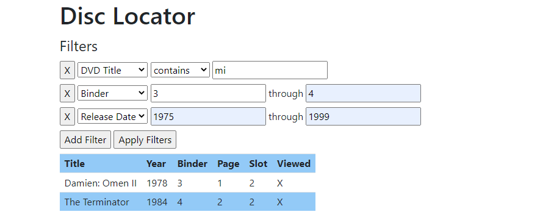

# DVD Discs Locator

Based on the Web Application built in the Book ['jQuery in Action Third Edition'][1] by Bear Bibeault and Yehuda Katz (Manning, 2015).

This application corresponds to the "DVD discs locator" built in Chapter 7.

>You'll solve the problem by writing a DVD database program to help
keep track of what DVDs you have and where they are.

_Note_: Due to security restrictions of some browsers, you may fail in playing
with this demo. To avoid this issue, you can either execute the page under a
web server like Apache, Tomcat, or IIS or search for a specific solution for
your browser.

## Prerequisites

- A web server

## Getting started

1. Clone the project.
1. Copy the content of `src` into your webserver's root folder.
1. Open <http://localhost> in your browser.

## Screen capture

## License

[MIT License](./LICENSE)

Copyright &copy; 2022 Felipe Romero

[1]: https://www.manning.com/books/jquery-in-action-third-edition
